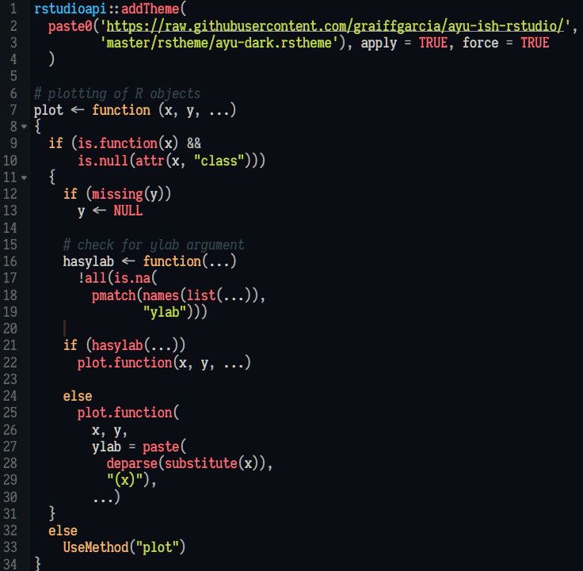
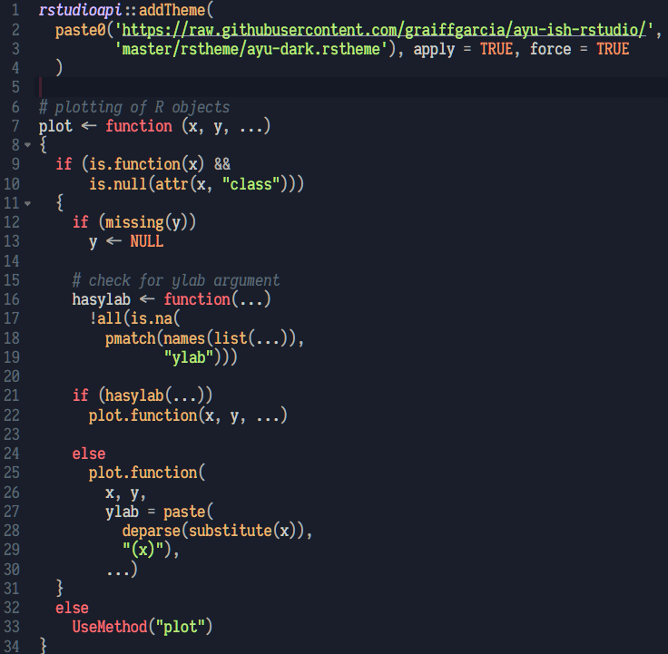

# Ayu-ish themes for RStudio
Two themes for RStudio, inspired by [the ayu-dark theme](https://github.com/ayu-theme/vscode-ayu) and the [Mayukai mirage darker theme](https://github.com/GulajavaMinistudio/Mayukai-Theme) for VSCode.

### Install
```R
# Ayu Dark-ish
rstudioapi::addTheme("https://raw.githubusercontent.com/graiffgarcia/ayu-ish-rstudio/master/rstheme/ayu-dark.rstheme", 
    apply = TRUE, force = TRUE)

# Mayukai Mirage Darker-ish
rstudioapi::addTheme("https://raw.githubusercontent.com/graiffgarcia/ayu-ish-rstudio/master/rstheme/mayukai-mirage-darker.rstheme", 
    apply = TRUE, force = TRUE)
```

### Screenshots
#### Ayu Dark


#### Mayukai Mirage Darker
